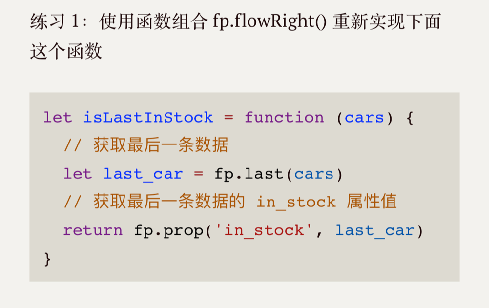

# part1 \| 模块2

## 一，基于以下代码完成下面四个练习

!\[\]\(../../.gitbook/assets/image%20\(21\).png\)



```javascript
let isLastInStock = fp.flowRight(
  fp.prop('in_stock'),
  fp.last
);
```

!\[\]\(../../.gitbook/assets/image%20\(20\).png\)

```javascript
const getFirstCarName = fp.flowRight(
  fp.prop('name'),
  fp.first
)
```

!\[\]\(../../.gitbook/assets/image%20\(1\).png\)

```javascript
let _average = xs => fp.reduce(fp.add, 0, xs) / xs.length;
let averageDollarValue = fp.flowRight(
  _average,
  fp.map(car => car.dollar_value)
);
```

!\[\]\(../../.gitbook/assets/image%20\(4\).png\)

```javascript
const sanitizeNames = fp.flowRight(
  fp.map(_underscore)
)
```

## 二， 基于以下代码完成后续的四个练习

!\[\]\(../../.gitbook/assets/image%20\(8\).png\)

!\[\]\(../../.gitbook/assets/image%20\(11\).png\)

```javascript
let maybe = Maybe.of([5, 6, 1]);
let ex1 = (x) => {
   return maybe.map(fp.map(fp.add(x)));
}
const functor = ex1(10);
// functor._value 为 15, 16, 11
```

!\[\]\(../../.gitbook/assets/image%20\(23\).png\)

```javascript
let xs = Container.of(['do', 'ray', 'me', 'fa', 'so', 'la', 'ti', 'do']);

let ex2 = () => {
  return xs.map(fp.first)._value;
}
```

!\[\]\(../../.gitbook/assets/image%20\(14\).png\)

```javascript
let ex3 = () => {
  return safeProp('name', user).map(fp.first)._value;
}
```

!\[\]\(../../.gitbook/assets/image%20\(6\).png\)

```javascript
let ex4 = function (n) {
  return Maybe.of(n).map(parseInt);
}
```

## 四，描述引用计数的工作原理和优缺点

工作原理：记录下每个对象被多少其他对象引用的数字，当对应对象的引用数字为零时，对象就需要被垃圾回收。

### 优点：

* 可被立即回收
* 回收速度快，单次垃圾回收量不大
* 不用沿着引用链查找

### 缺点：

* 计数器更新频繁，只要引用改变，对象的计数器就改变
* 计数器本身也需要空间
* 无法回收循环引用的对象

## 五，描述标记整理算法的工作流程

分标记和整理阶段  
**标记阶段**：标记出需要回收的对象，遍历堆上的对象，标出活动对象  
**整理阶段**：移动或复制对象，将所有存活对象复制到堆的一端，然后清理掉端边界以外的内容

## 六，描述v8中新生代存储区垃圾回收流程

新生代内存区分为两个等大小空间，使用空间为from，空闲空间为to，活动对象存储于from空间中，标记整理后将活动对象拷贝至to空间，最后from与to交换空间完成释放，如果经历了一定次数的新生代 GC或者to空间使用率超过20%，它会得到晋升，被复制到老生代

## 七，描述增量标记算法在何时使用及工作原理

对于老生代的空间配置大，存活对象多，垃圾的标记，整理会占用很大时间，所以为了降低全堆垃圾回收的停顿时间，在标记时候采用增量标记方式。

程序执行一段时间后，先标记直接可达对象，然后继续执行程序，之后再继续标记间接可达对象，将标记拆分为多个过程，每个标记过程完成后，就执行js程序一段时间，垃圾回收和js执行交替进行，直到标记阶段完成。后续就是进行整理和清除

